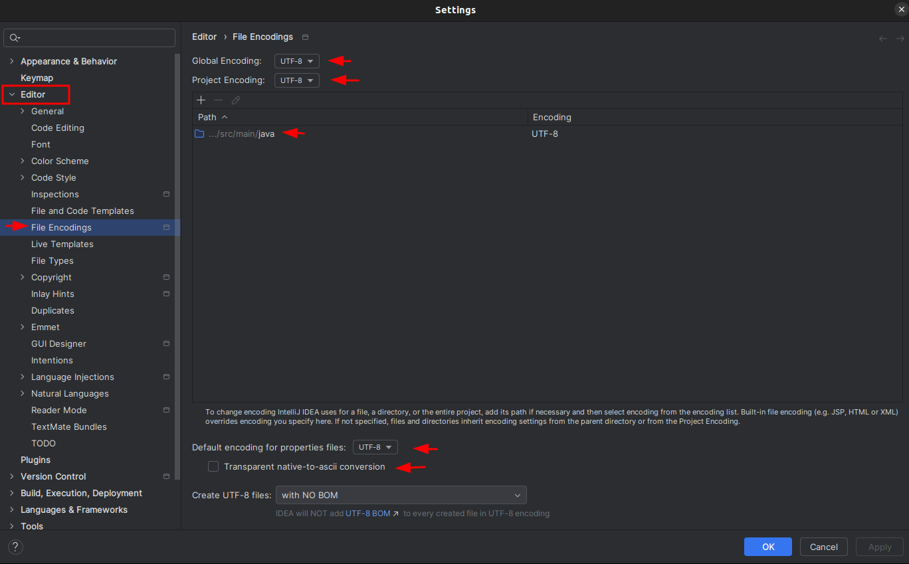
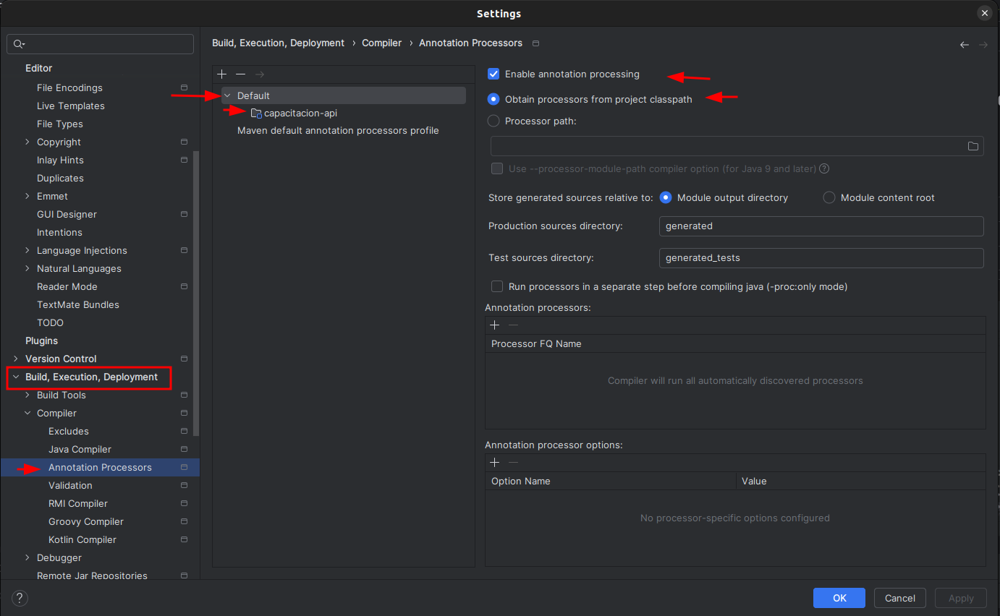

# backend-capacitacion
* [Project in GitHub](https://github.com/jhonnnier/backend-capacitacion)
* [Lombok](https://projectlombok.org/)
* [Project generator](https://start.spring.io/)
* [swagger](http://localhost:8088/capacitance/swagger-ui/index.html)

| Dependencia                                                   | descripción                           |
|---------------------------------------------------------------|---------------------------------------|
| [spring-boot-starter-aop](https://acortar.link/kBg46w)|Activa las anotaciones personalizadas |
| [spring-boot-starter-validation](https://acortar.link/PimErT) | Activa los validators personalizados|
|                                                               |                                       |

* Configurar UTF-8

* Configurar Lombok

