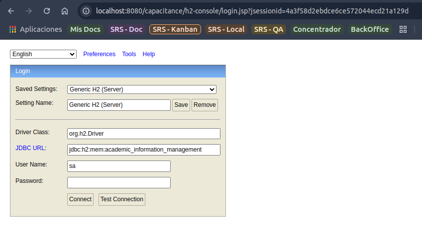
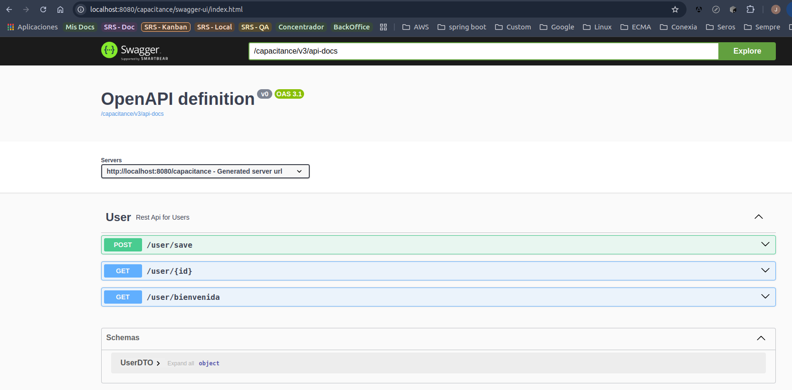
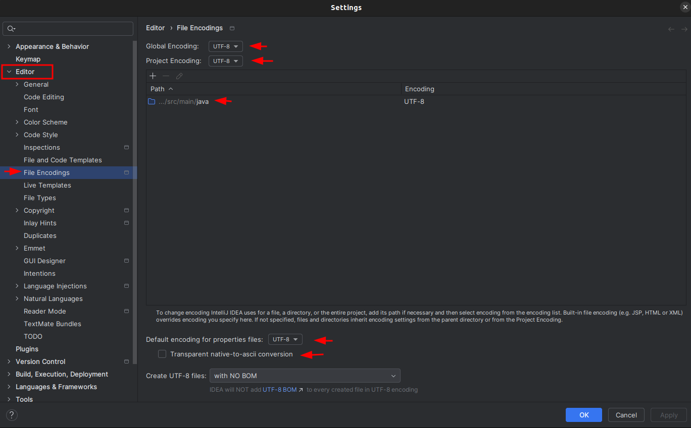
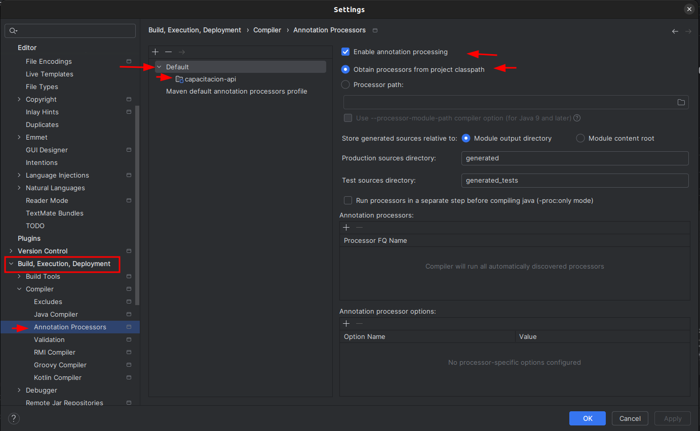

# backend-capacitacion
* [Project in GitHub](https://github.com/jhonnnier/backend-capacitacion)
* [Lombok](https://projectlombok.org/)
* [Project generator](https://start.spring.io/)
* [Swagger](http://localhost:8088/capacitance/swagger-ui/index.html)
* [H2 - console](http://localhost:8088/capacitance/h2-console)
* [Configuración](#section-configuracion)
* [SDKMan](#section-sdk-man)


| Dependencia                                                   | descripción                           |
|---------------------------------------------------------------|---------------------------------------|
| [spring-boot-starter-aop](https://acortar.link/kBg46w)|Activa las anotaciones personalizadas |
| [spring-boot-starter-validation](https://acortar.link/PimErT) | Activa los validators personalizados|
|                                                               |                                       |

* [H2 - console](http://localhost:8088/capacitance/h2-console)
  

* [Swagger](http://localhost:8088/capacitance/swagger-ui/index.html)
  

* Configurar UTF-8
  

* Configurar Lombok
  

### <section id="section-configuracion">Configuración</section>

Aplicación Spring Boot 3.4.3 sobre Java 17, con base de datos H2 en memoria. La configuración vive en `src/main/resources/application.yml`.

#### Servidor

| Propiedad                      | Valor          | Descripción                                  |
|--------------------------------|----------------|----------------------------------------------|
| `server.port`                  | `8088`         | Puerto HTTP de la aplicación                 |
| `server.servlet.context-path`  | `/capacitance` | Prefijo de todas las rutas                   |
| `server.error.include-message` | `always`       | Incluye el mensaje de error en las respuestas |

Todas las URLs quedan bajo el context-path, por ejemplo: `http://localhost:8088/capacitance/...`.

#### Base de datos H2 (en memoria) y seed

| Propiedad                                | Valor                    | Descripción                                                  |
|------------------------------------------|--------------------------|--------------------------------------------------------------|
| `spring.datasource.url`                  | `jdbc:h2:mem:managemt`   | Base de datos H2 en memoria                                  |
| `spring.jpa.hibernate.ddl-auto`          | `create`                 | Hibernate genera el esquema a partir de las entidades JPA    |
| `spring.jpa.defer-datasource-initialization` | `true`               | Ejecuta el seed `data.sql` **después** de crear el esquema   |
| `spring.sql.init.mode`                   | `always`                 | Ejecuta siempre el seed `data.sql` al arrancar               |

El seed `src/main/resources/data.sql` puebla la tabla `ruls` (mapeada por la entidad `Rule`) con datos iniciales. El orden de inicialización (esquema y luego seed) depende de `defer-datasource-initialization: true`; sin él, el seed correría antes de que existan las tablas y fallaría.

Notas de mapeo de entidades:
- La entidad `User` se mapea a la tabla `users` con `@Table(name = "users")`, porque `user` es palabra reservada en H2 y su uso como nombre de tabla rompe la generación del DDL.
- La entidad `Rule` se mapea a la tabla `ruls` con `@Table(name = "ruls")` y define las columnas `id`, `code`, `description`, `active` que el seed inserta.

Consola H2 (requiere la app corriendo):

```
http://localhost:8088/capacitance/h2-console
```

Datos de conexión en la consola:

| Campo    | Valor                  |
|----------|------------------------|
| JDBC URL | `jdbc:h2:mem:managemt` |
| User     | `sa`                   |
| Password | *(vacío)*              |

#### Swagger / OpenAPI (springdoc)

Documentación de la API generada con `springdoc-openapi-starter-webmvc-ui` (ya declarada en el `pom.xml`). La metadata (título, versión, descripción, contacto, licencia y server) se define en `config/OpenApiConfig.java`, y los paths en `application.yml`.

| Propiedad                    | Valor               | Descripción                       |
|------------------------------|---------------------|-----------------------------------|
| `springdoc.api-docs.path`    | `/v3/api-docs`      | Endpoint del documento OpenAPI (JSON) |
| `springdoc.swagger-ui.path`  | `/swagger-ui.html`  | Ruta de la interfaz Swagger UI    |
| `springdoc.swagger-ui.operations-sorter` | `method` | Ordena las operaciones por método HTTP |
| `springdoc.swagger-ui.tags-sorter`        | `alpha`  | Ordena los tags alfabéticamente   |

URLs (requieren la app corriendo):

```
Swagger UI:   http://localhost:8088/capacitance/swagger-ui/index.html
OpenAPI JSON: http://localhost:8088/capacitance/v3/api-docs
```

> Las rutas de Swagger (`/swagger-ui/**`, `/v3/api-docs/**`) y de la consola H2 (`/h2-console/**`) están excluidas del `LoggingInterceptor` en `interceptor/WebMvcConfig.java` para que el interceptor no interfiera con esos recursos.

#### Ejecutar la aplicación

```
./mvnw spring-boot:run
```

Al arrancar correctamente, el log muestra `Tomcat started on port 8088 (http) with context path '/capacitance'` y `Started CapacitacionApiApplication`.

### <section id="section-sdk-man">Instalar SDKMan</section>
```
curl -s "https://get.sdkman.io" | bash
source "$HOME/.sdkman/bin/sdkman-init.sh"
sdk version
```
- Instalar JAVA con SDKMan

```
sdk list java
sdk install java 17.0.12-oracle
sdk use 17.0.12-oracle
java -version

sdk list java
sdk install java 11.0.14.1-jbr
sdk use java 11.0.14.1-jbr
java -version

sdk list java
sdk install java 21.0.6-oracle
sdk use java 21.0.6-oracle
java -version

sdk list java
sdk install java 8.0.442-zulu
sdk use java 8.0.442-zulu
java -version
```